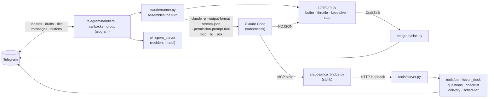

<p align="right">🇺🇸 English · <a href="README.md">🇧🇷 Português</a></p>

<h1 align="center">claude-telegram-bot-v2</h1>

<p align="center">
  <b>Claude Code in your pocket.</b><br>
  Talk to Claude Code running on your machine by text, voice or image — watch the answer
  being written in real time on Telegram, approve commands with one tap, and let scheduled
  tasks work while you're away.
</p>

<p align="center">
  
  
  
  
  
  
</p>

---

## ✨ What it feels like

```
you      🎤 (12-second voice note)
bot      📝 Transcribed: check whether backend MR 1580 is green and tell me what's left to merge
bot      ┆ Thinking…                                  ← native draft, grows on its own
bot      ┆ Let me look at the !1580 pipeline.
         ┆ 🔧 Bash · glab mr view 1580 --repo …        ← tool currently running
bot      🔐 Permission · Bash
         ┃ glab ci retry 1580
         [ ✅ Approve ] [ ❌ Deny ]
         [ 🔁 Always in this session ] [ 📋 Copy command ]
you      ✅
bot      ▸ 🔎 Progress (3 tools)                      ← collapsible (Rich Message)
         !1580 is green. The only thing left is Bruno's approval — the lint job
         passed on the second attempt.
         ⏱ 41s · ↓96k ↑312 tokens · 4 turns
```

Every **topic** in the chat is a project with its own session. `/new habilis` opens another
context without mixing anything up. Asked for *"send me the open MRs every day at 9"*? That
becomes a scheduled job firing in the same topic. Need to pick between A and B? Claude asks
with **buttons**.

## 🚀 Why it exists

Driving Claude Code from a phone always had three pains: **not knowing whether it hung**,
**one project per bot**, and **`--dangerously-skip-permissions` as the only policy**.
Between Dec 2025 and Aug 2026 Telegram shipped native primitives for AI bots — streaming
drafts with a *Stop* button, topics in private chats, Rich Messages, ephemeral messages,
guest mode — and this bot uses all of them. It was rewritten on **aiogram 3.31** because it
is the only Python library exposing Bot API 10.x.

## 🧩 What it does

| | |
|---|---|
| ⚡ **Real streaming** | `sendMessageDraft`: native "Thinking…" placeholder, text growing live, `🔧 Bash · git status` while a tool runs, automatic keepalive. The client's **Stop** button (or `/cancel`) kills the process and keeps the partial output. |
| 🧵 **Topics = sessions** | Each topic has its own project (`cwd`) and Claude session. `/new <alias>`, `/fork` (branch the conversation), `/project`, `/sessions` (resume any recent Claude Code session). Automatic title after the first turn. |
| 🔐 **One-tap approval** | `--permission-prompt-tool` → MCP bridge → card with **Approve / Deny / Always in this session / Copy**. Sensitive commands (`rm`, `push`, `DROP`, `deploy`, `ssh`…) require **two taps**. Claude waits up to 24 h for your decision. `/yolo [min]` switches it all off for a while, in that topic only. |
| 📝 **Rich Messages** | Headings, tables, code, task lists. The "reasoning" between tools goes into a collapsible `<details>`; the answer stays clean. Automatic HTML fallback. |
| ☑️ **Live checklist** | `update_checklist` tool: Claude registers the plan and ticks steps in a message edited in place. |
| 🎤 **Voice** | **Resident** WhisperX `large-v3` (model loaded once, ~0.5 s per audio, unloads when idle). Echoes `📝 Transcribed:` before answering. |
| 🖼️ **Images** | Photo or image document → Claude opens it with `Read`. The caption is the request. |
| ↩️ **Reply** | Replying to a message (text, transcript, image, selected quote) puts its content into the prompt. |
| ❓ **Questions with buttons** | `ask_user(question, options, multi)` tool: single or multiple choice; Claude continues with the answer. |
| 📎 **Files** | png/pdf/mp3/mp4 mentioned by absolute path arrive on their own; the `send_file` tool delivers any file. |
| ⏰ **Schedules** | `schedule` tool (5-field cron or `every_seconds`): fires in the originating topic with its own session. `/jobs`, `/unschedule`. |
| 🔗 **Deep links** | `/link habilis` or `/link HT-123` → `t.me/<bot>?start=…` opens a topic already in the right project. |
| 👥 **Groups / guest mode** | In allowed groups, triggered by a **reply** to a bot message, by **`/ask <question>`**, or by a mention (`@bot` only arrives with *Group Privacy* off — Telegram doesn't deliver mentions in privacy mode). Without being a member, via guest mode. **Ephemeral** answer visible only to the asker (`#todos` = public; ephemeral requires the bot to be a group **admin** — otherwise it answers publicly, as a reply). Groups never get approval prompts: anything outside the allowlist is denied. In a **channel** (bot as admin), a post with `/ask …` gets a public reply. |

## 🛡️ Permission policy

Claude Code evaluates *ask* rules **before** *allow* rules — including the global ones in
your `~/.claude/settings.json` — and before `acceptEdits`. The bot passes
`--settings '{"permissions":{"ask":["Bash","Edit","Write","NotebookEdit"]}}'` so every command
and file write lands on the bot's desk, which decides in three steps:

1. **You already approved "always in this session"** → run, even if sensitive.
2. **Built-in read-only set** (`ls`, `cat`, `git status`…), **`Edit`/`Write`**, or the project's **`allowed_tools`** → run, **except** when sensitive: a command matching a pattern (`rm`, `git push`, `DROP TABLE`, `curl | sh`, `kubectl delete`…) or a write to a sensitive path (`.env`, `~/.ssh`, `/etc`, `*.pem`, `settings.json`…).
3. Otherwise → **ask** (private chat) or **deny** (group, guest, job in a group).

The three lists live in **`permissions.json`** (copy from `permissions.example.json`; reloaded
automatically on change). Every decision goes to `.decisions.jsonl`, and **`/audit`** summarizes
it: whatever was asked and always approved becomes a *"➕ add to project"* button that writes
the rule into `projects.json`.

## ⚙️ Quick start

```bash
git clone git@github.com:correaschneider/claude-telegram-bot-v2.git && cd claude-telegram-bot-v2
uv sync
cp .env.example .env                      # TELEGRAM_TOKEN, ALLOWED_CHAT_IDS, WORKSPACE
cp projects.example.json projects.json    # alias → cwd, allowed_tools, tasks, chats
uv run tgclaude
```

In **@BotFather → Mini App → your bot → Settings**: turn on **Threaded Mode** (topics) and,
if you want groups without adding the bot, **Guest Chat Mode**. Propagation takes ~5 min.

To run it as a service, install WhisperX and troubleshoot: **[INSTALL.en.md](INSTALL.en.md)**.

## 🏗️ Architecture



Ports & adapters: the core (`core/turn.py`) only knows `RunningClaude` (events) and
`DraftSink` (draft/delivery). That's why the 19 tests run without a token, network or GPU —
and the real flows (approve, deny, "always", groups, questions, schedules, files) were
validated end to end against the real Claude.

Standard Python application layout: installable package in **`src/tgclaude/`** (*src layout*),
entrypoint declared in `pyproject.toml` (`uv run tgclaude` or `python -m tgclaude`), tests in
`tests/` with pytest, and non-package files in `deploy/`. Subpackages per layer: `core/` (no
Telegram, no subprocess), `claude/` (Claude Code side), `tools/` (what the bridge exposes to
Claude) and `telegram/` (aiogram adapters).

| Module | Responsibility |
|---|---|
| `app.py` · `__main__.py` | composition root / entrypoint (`tgclaude`) |
| `config.py` · `services.py` | `Config.from_env()`, dependency container |
| `core/turn.py` | turn core: segments, throttle, keepalive, stop, outcome |
| `core/permissions.py` · `core/audit.py` | policy (read-only / sensitive / paths), `decide()`, decision log |
| `core/projects.py` · `core/store.py` · `core/formatting.py` | project registry, persisted `(chat, topic)` conversation, Markdown → Rich/HTML |
| `claude/stream.py` · `claude/runner.py` | Claude subprocess (NDJSON → events, flags) and turn orchestration |
| `claude/mcp_bridge.py` · `claude/sessions_index.py` | MCP stdio server (stdlib only) spawned by Claude; session index |
| `tools/server.py` | the bot's HTTP loopback (`/ask`, `/tool/<name>`) |
| `tools/permission_desk.py` · `tools/questions.py` · `tools/checklist.py` · `tools/delivery.py` · `tools/scheduler.py` | what the bridge exposes: approval, `ask_user`, `update_checklist`, `send_file`, `schedule` |
| `telegram/sink.py` · `telegram/handlers.py` · `telegram/callbacks.py` · `telegram/group.py` | aiogram adapters: draft/delivery, commands, buttons+Stop, groups/guest |
| `telegram/media.py` · `telegram/transcriber.py` | voice/image download, reply context, WhisperX (server + CLI) |
| `deploy/` | `systemd --user` units for the bot and `whisperx_server.py` |
## 🧪 Development

```bash
uv run ruff format . && uv run ruff check .
uv run pytest
```

## 🗺️ Roadmap

- [ ] Telegram Mini App: session dashboard, syntax-highlighted diffs and **biometric confirmation** for production deploys (needs a public HTTPS domain).
- [ ] Ephemeral + guest mode in channels/communities.
- [ ] Fine-tune the read-only/sensitive lists from real usage.

---

<p align="center">Built by a dev who wanted to follow Claude Code's work from his phone without opening SSH.</p>
