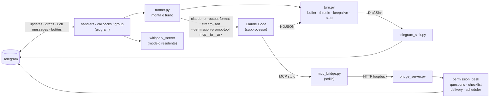

<h1 align="center">claude-telegram-bot-v2</h1>

<p align="center">
  <b>Claude Code no bolso.</b><br>
  Fale por texto, voz ou imagem com o Claude Code rodando na sua máquina — e veja a resposta
  nascer em tempo real no Telegram, aprove comandos com um toque e deixe tarefas agendadas
  trabalhando enquanto você está na rua.
</p>

<p align="center">
  
  
  
  
  
  
</p>

---

## ✨ Como é usar

```
você     🎤 (áudio de 12 s)
bot      📝 Transcrito: vê se o MR 1580 do backend tá verde e me diz o que falta pra mergear
bot      ┆ Thinking…                                  ← rascunho nativo, cresce sozinho
bot      ┆ Vou olhar o pipeline do !1580.
         ┆ 🔧 Bash · glab mr view 1580 --repo …        ← ferramenta em execução
bot      🔐 Permissão · Bash
         ┃ glab ci retry 1580
         [ ✅ Aprovar ] [ ❌ Negar ]
         [ 🔁 Sempre nesta sessão ] [ 📋 Copiar comando ]
você     ✅
bot      ▸ 🔎 Progresso (3 ferramentas)               ← colapsável (Rich Message)
         O !1580 está verde. Falta só o approve do Bruno — o job de lint passou
         na 2ª tentativa.
         ⏱ 41s · ↓96k ↑312 tokens · 4 turnos
```

Cada **tópico** do chat é um projeto com sessão própria. Um `/new habilis` abre outro
contexto, sem misturar. Pediu *"todo dia 9h me manda os MRs abertos"*? Vira um agendamento
que dispara no mesmo tópico. Precisa decidir entre A e B? O Claude pergunta com **botões**.

## 🚀 Por que existe

Operar o Claude Code pelo celular sempre teve três dores: **não saber se travou**, **um só
projeto por bot** e **`--dangerously-skip-permissions` como única política**. Entre dez/2025
e ago/2026 o Telegram lançou primitivos nativos pra bots de IA — rascunho em streaming com
botão *Stop*, tópicos em chat privado, Rich Messages, mensagens efêmeras, guest mode — e este
bot usa todos eles. Foi reescrito em **aiogram 3.31** porque é a única lib Python que expõe a
Bot API 10.x.

## 🧩 O que ele faz

| | |
|---|---|
| ⚡ **Streaming de verdade** | `sendMessageDraft`: placeholder "Thinking…" nativo, texto crescendo, `🔧 Bash · git status` enquanto a ferramenta roda, keepalive automático. Botão **Stop** do cliente (ou `/cancel`) mata o processo e preserva o parcial. |
| 🧵 **Tópicos = sessões** | Cada tópico tem projeto (`cwd`) e sessão do Claude próprios. `/new <alias>`, `/fork` (bifurca a conversa), `/project`, `/sessions` (retoma qualquer sessão recente do Claude Code). Título automático após o 1º turno. |
| 🔐 **Aprovação por toque** | `--permission-prompt-tool` → bridge MCP → card com **Aprovar / Negar / Sempre nesta sessão / Copiar**. Comando sensível (`rm`, `push`, `DROP`, `deploy`, `ssh`…) exige **dois toques**. O Claude espera até 24 h pela sua decisão. `/yolo [min]` desliga tudo por um prazo, só naquele tópico. |
| 📝 **Rich Messages** | Headings, tabelas, code, task list. O "raciocínio" entre ferramentas vai num `<details>` colapsável; a resposta fica limpa. Fallback automático pra HTML. |
| ☑️ **Checklist viva** | Tool `update_checklist`: o Claude registra o plano e vai marcando etapas numa mensagem editada in-place. |
| 🎤 **Voz** | WhisperX `large-v3` **residente** (modelo carregado uma vez, ~0,5 s por áudio, descarrega quando ocioso). Eco `📝 Transcrito:` antes de responder. |
| 🖼️ **Imagem** | Foto ou documento de imagem → o Claude abre com `Read`. A legenda é o pedido. |
| ↩️ **Reply** | Responder a uma mensagem (texto, transcrição, imagem, trecho selecionado) põe o teor dela no prompt. |
| ❓ **Perguntas com botões** | Tool `ask_user(question, options, multi)`: escolha única ou múltipla, o Claude continua com a resposta. |
| 📎 **Arquivos** | png/pdf/mp3/mp4 citados por caminho absoluto chegam sozinhos; tool `send_file` entrega qualquer arquivo. |
| ⏰ **Agendamentos** | Tool `schedule` (cron de 5 campos ou `every_seconds`): dispara no tópico de origem com sessão própria. `/jobs`, `/unschedule`. |
| 🔗 **Deep link** | `/link habilis` ou `/link HT-123` → `t.me/<bot>?start=…` abre um tópico já no projeto certo. |
| 👥 **Grupos / guest mode** | Menção ou reply em grupos autorizados (mesmo sem ser membro, via guest mode): resposta **efêmera** só pra quem perguntou (`#todos` = pública). Em grupo nunca há aprovação: fora da allowlist é negado. |

## 🛡️ Política de permissão

Regras *ask* do Claude Code são avaliadas **antes** das *allow* — inclusive das globais do
seu `~/.claude/settings.json`. O bot passa `--settings '{"permissions":{"ask":["Bash"]}}'` e
todo `Bash` cai na mesa dele, que decide em três degraus:

1. **Você já aprovou "sempre nesta sessão"** → executa, mesmo se sensível.
2. **Read-only embutido** (`ls`, `cat`, `git status`…) ou **`allowed_tools` do projeto** → executa, **exceto** comando sensível.
3. Senão → **pergunta** (chat privado) ou **nega** (grupo, guest, job em grupo).

## ⚙️ Quick start

```bash
git clone git@github.com:correaschneider/claude-telegram-bot-v2.git && cd claude-telegram-bot-v2
uv sync
cp .env.example .env                      # TELEGRAM_TOKEN, ALLOWED_CHAT_IDS, WORKSPACE
cp projects.example.json projects.json    # alias → cwd, allowed_tools, tasks, chats
uv run bot.py
```

No **@BotFather → Mini App → seu bot → Settings**: ligue **Threaded Mode** (tópicos) e, se
quiser grupos sem adicionar o bot, **Guest Chat Mode**. Propaga em ~5 min.

Pra rodar como serviço, instalar o WhisperX e resolver problemas: **[INSTALL.md](INSTALL.md)**.

## 🏗️ Arquitetura



Portas & adaptadores: o núcleo (`turn.py`) só conhece `RunningClaude` (eventos) e
`DraftSink` (rascunho/entrega). Por isso os 18 testes rodam sem token, sem rede e sem GPU —
e os fluxos reais (aprovar, negar, "sempre", grupo, perguntas, agendamento, arquivos) foram
validados de ponta a ponta contra o Claude de verdade.

| Módulo | Responsabilidade |
|---|---|
| `app.py` · `bot.py` | composition root / entrypoint |
| `config.py` · `projects.py` | `Config.from_env()`, registry de projetos (`projects.json`) |
| `claude_stream.py` | subprocesso do Claude + `parse_line` (NDJSON → eventos) + flags |
| `turn.py` | núcleo do turno: segmentos, throttle, keepalive, stop, resultado |
| `runner.py` | orquestra um turno: RunSpec, bridge, política, sessão, título, entrega de mídia |
| `telegram_sink.py` | `TelegramSink` (privado: draft + rich) e `ReplySink` (grupo/guest) |
| `mcp_bridge.py` · `bridge_server.py` | servidor MCP stdio que o Claude sobe ↔ HTTP loopback do bot (`/ask`, `/tool/<nome>`) |
| `permissions.py` · `permission_desk.py` | regras, comando sensível, `decide()`, UI dos botões |
| `questions.py` · `checklist.py` · `delivery.py` · `scheduler.py` | tools `ask_user`, `update_checklist`, `send_file`, `schedule` |
| `media.py` · `transcriber.py` · `sessions_index.py` | download voz/imagem, reply-context, WhisperX (servidor + CLI), índice de sessões |
| `handlers.py` · `callbacks.py` · `group.py` | routers: privado/tópicos, botões+Stop, grupos/guest |
| `store.py` · `formatting.py` | conversa `(chat, tópico)` persistida; Markdown → Rich/HTML, chunking |
| `deploy/` | units `systemd --user` do bot e do `whisperx_server.py` |

## 🧪 Desenvolvimento

```bash
uv run ruff format . && uv run ruff check .
uv run python tests/test_core.py
```

## 🗺️ Roadmap

- [ ] Mini App do Telegram: painel de sessões, diff com highlight e **confirmação biométrica** pra deploy em produção (precisa de um domínio HTTPS público).
- [ ] Ephemeral + guest em canais/comunidades.
- [ ] Ajuste fino das listas read-only/sensível conforme o uso.

---

<p align="center">Feito por um dev que queria acompanhar o trabalho do Claude Code do celular sem abrir SSH.</p>
